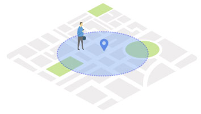

# `My Projects`

陳奎銘 Benjamin Chen

---


```html
<style>
    .container{
        display: flex;
    }
    .col{
        flex: 1;
    }
  </style>
```

```html
<section>
    <div class="container" data-background="media/background.png">
        
        <div data-markdown class="col"  style="font-size: 0.75em;">
        ### 陳奎銘 Benjamin
        - 學歷
            - 陽明大學
                - 醫學放射技術學系
                - 生物醫學資訊研究所
        - 經歷
            - Data Scientist
                - Momagic Inc.
                - Linker Networks Inc.
            - 數位發展部 資料應用輔導專家
            - R-Ladies Taipei 協辦人
            - Microsoft AI MVP

        </div>
        
        <div data-markdown class="col" style="font-size: 0.75em;">
        ### 
        - 授課經驗        
            - 政府公部門或協會：
                - 台灣資料科學愛好者年會
                - 工研院
                - 國防大學
                - 政治大學
                - 新北市程式教育體驗中心
                - 數位發展部
            - 公司行號：
                - 永豐銀行
                - 裕隆汽車
                - 港務公司


        </div>
    </div>
</section>
```
---

## Outline

- Location Analysis
- Air Quality Prediction
- Illegal Parking Detection
- Other Projects

---

# Location Analysis


----

<!-- .slide: data-background="media/mapping.png" -->

----

## Background

- MoMAGIC is one of the leading Indian companies in the Mobile AdTech & IoT space.
- Help customers understand their customers better
- Provide more accurate and personalized services or advertisements
- Challenges
    - The amount of data is large and messy
    - Administrative divisions are not consistent

----

## Data

- Data source: customers, vendors and open data
- Data type: 
    - Location data from users: ID, geolocation and timestamp
    - Point of Interesting data: geolocation, category, real estate price and salary.


----

## Data

- Data preprocessing:
    - Each user should have signals at least 7 days in the past 30 days.
    - Signals should cover from Monday to Sunday.
    - At least average 10 signals per day for each user.


----

<!-- .slide: data-background="media/latlon.png" -->


----

## Model

- Geolocation data would be a bunch of points on the same location
- DBSCAN: Density-based spatial clustering of applications with noise
    - Handles irregularly shaped and sized clusters
    - Robust to outliers
    - Does not require the number of clusters to be specified

----

### DBSCAN

[](media/DBSCAN.png)


----

## Mapping User Location to POI


- Electronic Fence: 
    - Closest place for user location


----

<!-- .slide: data-background="media/mapping.png" -->


---

# Air Quality Prediction


----


<!-- .slide: data-background="media/pm2_5.png" -->

----

## Background

- Smart City Taiwan Project
- Monitor and predict air quality in industrial area
- Challenges
    - Data quality
    - Only 3 airboxes
    - Cannot get data in the beginning

----

## Data

- Data source: airbox (include open data)
- Data type: time and PM2.5
- Data preprocessing:
    - 10-minute interval candlestick
        - Open, High, Low, and Close
        - Only use the closing value.


----

### Candlestick


----

## Data

- Data preprocessing:
    - Use two hours of data to predict the data for the next time pointf
    - Nomalization: (x - min) / (max - min)
    - Training:Validation:Testing = 7:2:1
    


----

## Model

- Long Short Term Memory (LSTM)
- Loss function: MSE (< 1e-5)


----

## Extention

- Water quality
- [Taiwan dollar to US dollar exchange rate](media/chatbot.png)
- Patent: A SMART TRENCH COVER SYSTEM FOR DETECTING FLOODS AND A METHOD FOR PERFORMING THE SAME


---

# Illegal Parking Detection


----

[](https://www.youtube.com/watch?v=xcdq3w2lOt4)


----

## Background

- Smart City Taiwan Project
- Detecting illegal parking situations in industrial.
- Challenges
    - Object detection model cannot track object
    - Sometimes objects will be detected twice in a frame

----


----

## Data

- Data source: 
    - Open Images Dataset
    - Images from CCTV
- Object type: car, truck, bus, bike
- Data preprocessing:
    - Create Annotation
        - Automatically
        - Mannually
    - Augmentation

----

## Model
- Object Detection: YOLO v2
- Tracker: Dlib correlation traker
- Max intersection over single

```python
"""
|-------|
| A |---|----|
|   | I |    |
|---|---|    |
    |     B  |
    |--------|
max(I/A, I/B)
"""
```


----

[](https://www.youtube.com/watch?v=xcdq3w2lOt4)


---

## Other Projects

- Biomedical
    - Simplify Malnutrition Survey Mechanisms
    - [Model](https://hackmd.io/_uploads/ryWHUjwS2.png) [for Liver fibrosis](https://pubmed.ncbi.nlm.nih.gov/28548299/)
- Time Series Data
    - Reinforcement Learning for future trading
    - The Serial Correlation Analysis of the Price Movements of Taiwan Weighted Stock Index Futures


----

## Other Projects

- Computer Vision
    - 2022 COSCUP- [Anti iHunch](https://kuiming.github.io/anti_iHunch/presentation/output/index.html#/)
    - [Recycle](https://www.youtube.com/watch?v=55BOh6R_QQM&list=PLZ7oApS1nsH7KxfFakr0ZwIeAKy_gUeK_#t=7m32s)
    - [Anomaly detection for Dispenser](https://www.youtube.com/watch?v=Yk7DKYoVO5Y)
    - [Porduct Search](media/product_search.png)
- Prompt Engineer
    - [AI project creator](https://demo.chimes.ai/ai-project-generator/edit-job?step=1)

---

Leverage my skills to solve problems in my life. 